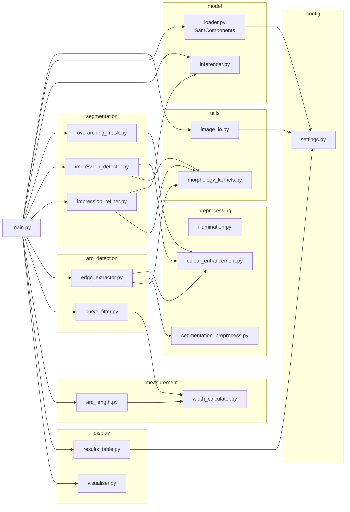
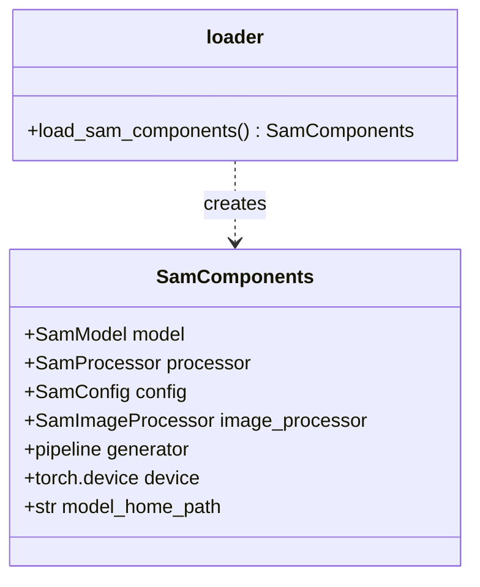
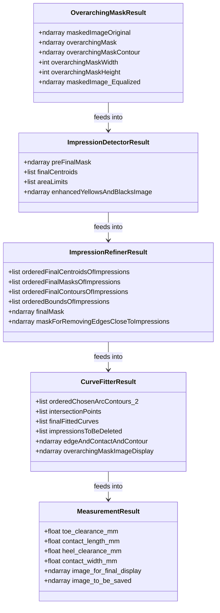
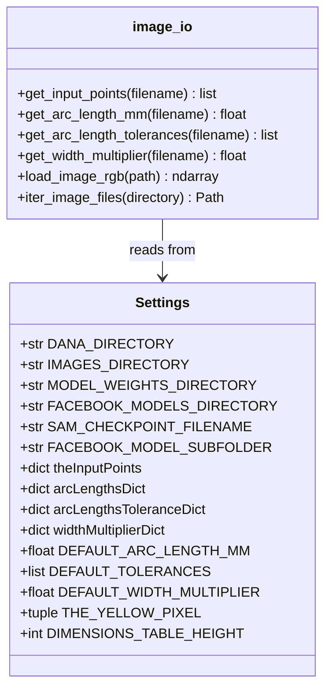
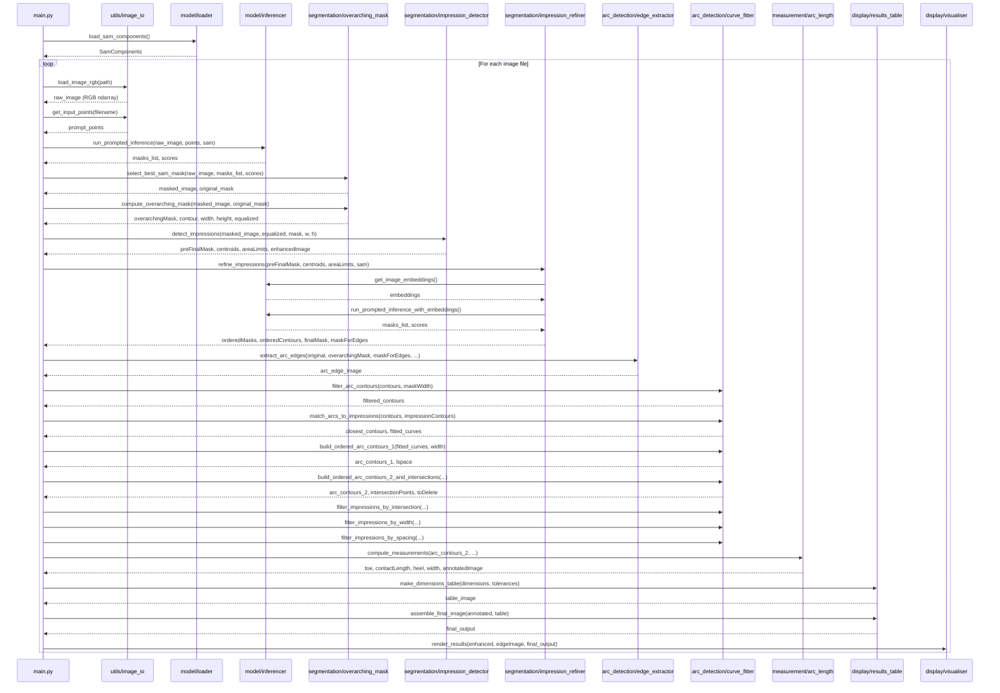
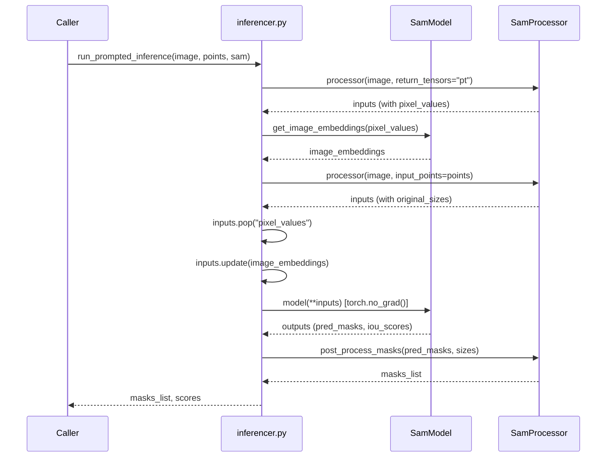
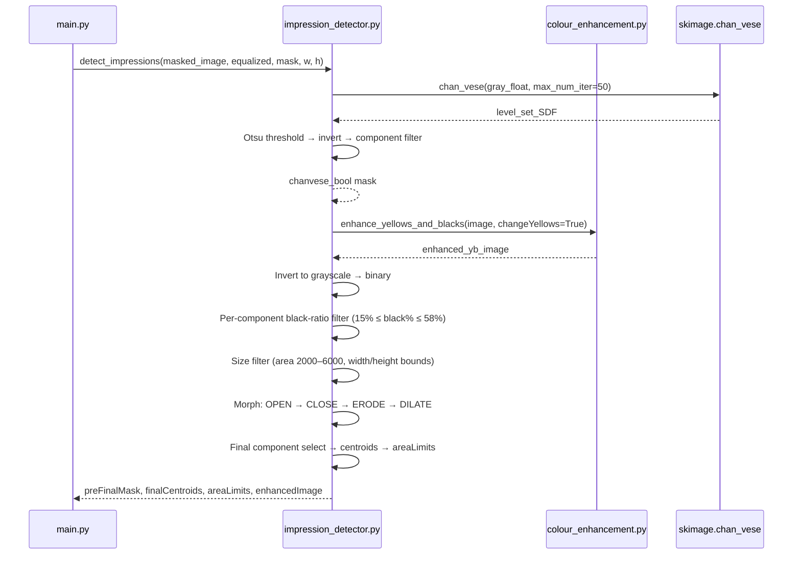
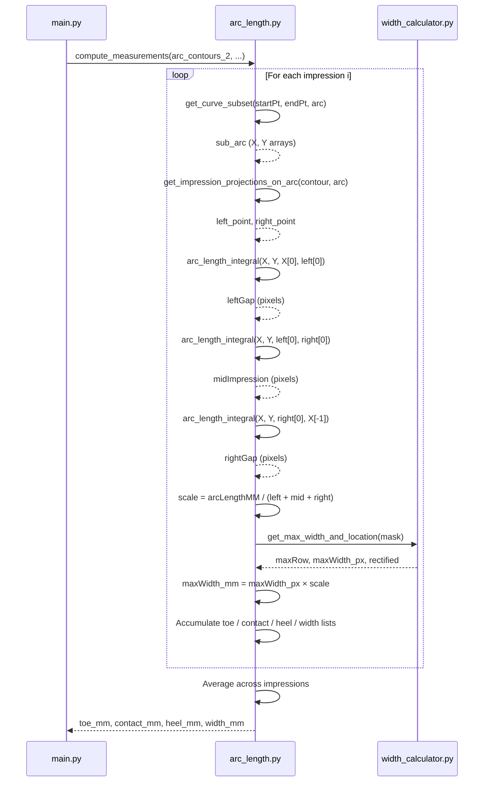

# HelicalGearQA

Automated quality inspection of helical gear teeth using the Facebook **Segment Anything Model (SAM)** and classical computer-vision techniques.

The system processes raw gear-tooth photographs (blue-dye contact pattern images) and produces five quantitative measurements:

| Measurement | Description |
|---|---|
| **Toe Clearance** | Gap between the contact patch and the toe (narrow end) of the tooth |
| **Contact Length** | Arc length of the contact impression along the tooth face |
| **Heel Clearance** | Gap between the contact patch and the heel (wide end) of the tooth |
| **Contact Width** | Cross-sectional width of the contact impression |
| **Tip Clearance** | Clearance at the tip of the tooth *(not yet implemented)* |

Each measurement is compared against a per-component tolerance band and colour-coded green (pass) or red (fail) in the output image.

---

## Table of Contents

1. [Project Structure](#project-structure)
2. [Quick Start](#quick-start)
3. [Configuration](#configuration)
4. [Image Processing Pipeline](#image-processing-pipeline)
5. [Package & Module Overview](#package--module-overview)
6. [Class & Data Structure Diagrams](#class--data-structure-diagrams)
7. [Interaction Diagrams](#interaction-diagrams)
8. [Dependency Graph](#dependency-graph)
9. [Output Example](#output-example)
10. [Adding a New Component](#adding-a-new-component)
11. [Dependencies](#dependencies)

---

## Project Structure

```
gear_inspection/
│
├── main.py                          # Entry point
│
├── config/
│   └── settings.py                  # All hardcoded config & calibration data
│
├── model/
│   ├── loader.py                    # SAM model loading (SamComponents dataclass)
│   └── inferencer.py                # SAM inference helpers
│
├── preprocessing/
│   ├── illumination.py              # Ying 2017 CAIP low-light enhancement
│   ├── colour_enhancement.py        # Gamma, CLAHE, yellow/black enhancement
│   └── segmentation_preprocess.py   # K-Means colour quantisation
│
├── segmentation/
│   ├── overarching_mask.py          # SAM Pass 1 — gear tooth region
│   ├── impression_detector.py       # Chan-Vese + morphological impression finder
│   └── impression_refiner.py        # SAM Pass 2 — per-impression masks
│
├── arc_detection/
│   ├── edge_extractor.py            # Dual-path arc skeleton extraction
│   └── curve_fitter.py              # Polynomial fitting, arc matching, pruning
│
├── measurement/
│   ├── arc_length.py                # Arc-length integration + measurement loop
│   └── width_calculator.py          # Rotation-rectification max-width
│
├── display/
│   ├── results_table.py             # OpenCV dimensions table + alpha overlay
│   └── visualiser.py                # Matplotlib three-panel figure
│
└── utils/
    ├── image_io.py                  # Image loading, file iteration, config lookups
    └── morphology_kernels.py        # Pre-built OpenCV structuring elements
```

---

## Quick Start

```bash
# 1. Clone the repository
git clone https://github.com/UBags/HelicalGearQA.git
cd HelicalGearQA

# 2. Create and activate a virtual environment
python -m venv .venv
source .venv/bin/activate        # Windows: .venv\Scripts\activate

# 3. Install dependencies
pip install torch torchvision torchaudio --index-url https://download.pytorch.org/whl/cu121
pip install transformers opencv-python matplotlib scikit-image scipy scikit-learn pandas Pillow imutils

# 4. Install SAM
pip install 'git+https://github.com/facebookresearch/segment-anything.git'

# 5. Edit config/settings.py — set DANA_DIRECTORY to your local data path

# 6. Run
python main.py
```

---

## Configuration

All configuration lives in **`config/settings.py`**. No other file needs to be edited to add a new component or change paths.

| Setting | Description |
|---|---|
| `DANA_DIRECTORY` | Root path to all data (images, model weights) |
| `SAM_CHECKPOINT_FILENAME` | SAM `.pth` weight file name |
| `FACEBOOK_MODEL_SUBFOLDER` | HuggingFace model subfolder (`large`, `base`, `huge`) |
| `theInputPoints` | SAM prompt points per component (keyed by filename substring) |
| `arcLengthsDict` | Known physical arc length (mm) per component |
| `arcLengthsToleranceDict` | Pass/fail tolerance ranges per component |
| `widthMultiplierDict` | Width scaling factor per component |

---

## Image Processing Pipeline

The full processing pipeline for a single image:

```mermaid
flowchart TD
    A([Raw BMP Image]) --> B[Load as RGB]
    B --> C{Prompt points\ndefined?}
    C -- No --> Z([Skip image])
    C -- Yes --> D

    subgraph SAM_PASS_1 ["SAM Pass 1 — Gear Tooth Region"]
        D[run_prompted_inference] --> E[select_best_sam_mask\nsmallest qualifying mask]
        E --> F[compute_overarching_mask\ngamma → CLAHE → blur → threshold]
        F --> G[(overarchingMask\noverarchingMaskContour\nmaskWidth / maskHeight)]
    end

    G --> H

    subgraph IMPRESSION ["Impression Detection"]
        H[detect_impressions] --> H1[Chan-Vese segmentation]
        H1 --> H2[Yellow/Black enhancement]
        H2 --> H3[Black-ratio component filter]
        H3 --> H4[Size component filter]
        H4 --> H5[Morphological cleanup\nopen → close → erode → dilate]
        H5 --> I[(preFinalMask\nfinalCentroids\nareaLimits)]
    end

    I --> J

    subgraph SAM_PASS_2 ["SAM Pass 2 — Impression Refinement"]
        J[refine_impressions] --> J1[SAM inference with centroid prompts]
        J1 --> J2[Area-range mask validation]
        J2 --> J3[Contour extraction & centroid ordering]
        J3 --> K[(orderedFinalMasks\norderedFinalContours\norderedBounds\nfinalMask)]
    end

    K --> L

    subgraph ARC_DETECT ["Arc Detection"]
        L[extract_arc_edges] --> L1[Path 1: CLAHE clip=20 → K-Means\n→ thin skeleton]
        L --> L2[Path 2: CLAHE clip=8 → K-Means\n→ skeletonize]
        L1 --> L3[Merge paths → dilate → re-thin]
        L2 --> L3
        L3 --> M[(arc_edge_image)]
    end

    M --> N

    subgraph CURVE_FIT ["Curve Fitting & Matching"]
        N[filter_arc_contours\nwidth & curvature filters] --> O[match_arcs_to_impressions\ncdist nearest arc per impression]
        O --> P[build_ordered_arc_contours_1\nquadratic polyfit over linspace]
        P --> Q[build_ordered_arc_contours_2\ntranslate → re-fit → intersect boundary]
        Q --> R[filter_impressions_by_intersection\nfilter_impressions_by_width\nfilter_impressions_by_spacing]
        R --> S[(orderedChosenArcContours_2\nintersectionPoints)]
    end

    S --> T

    subgraph MEASURE ["Measurement"]
        T[compute_measurements] --> T1[get_curve_subset\nclip arc to boundary points]
        T1 --> T2[arc_length_integral\ntoe / contact / heel segments]
        T2 --> T3[get_max_width_and_location\nrotate-rectify impression mask]
        T3 --> T4[Scale pixels → mm\nusing arcLengthOfCurrentComponent]
        T4 --> U[(toe_clearance_mm\ncontact_length_mm\nheel_clearance_mm\ncontact_width_mm)]
    end

    U --> V

    subgraph DISPLAY ["Display"]
        V[make_dimensions_table\ngreen/red pass-fail] --> W[assemble_final_image\nphoto + table]
        W --> X[render_results\n3-panel matplotlib figure]
    end
```



---

## Package & Module Overview



---

## Class & Data Structure Diagrams

### SamComponents (model/loader.py)



### Key Data Flows Between Modules



### Settings & Calibration (config/settings.py)



---

## Interaction Diagrams

### Full Pipeline Sequence



### SAM Inference Detail



### Impression Detection Detail



### Arc Length Measurement Detail



---

## Dependency Graph

```mermaid
graph TD
    main --> config/settings
    main --> utils/image_io
    main --> model/loader
    main --> model/inferencer
    main --> segmentation/overarching_mask
    main --> segmentation/impression_detector
    main --> segmentation/impression_refiner
    main --> arc_detection/edge_extractor
    main --> arc_detection/curve_fitter
    main --> measurement/arc_length
    main --> display/results_table
    main --> display/visualiser

    utils/image_io --> config/settings

    model/loader --> config/settings
    model/inferencer --> model/loader

    segmentation/overarching_mask --> preprocessing/colour_enhancement
    segmentation/impression_detector --> preprocessing/colour_enhancement
    segmentation/impression_detector --> utils/morphology_kernels
    segmentation/impression_refiner --> model/inferencer
    segmentation/impression_refiner --> utils/morphology_kernels

    arc_detection/edge_extractor --> preprocessing/colour_enhancement
    arc_detection/edge_extractor --> preprocessing/segmentation_preprocess
    arc_detection/edge_extractor --> utils/morphology_kernels
    arc_detection/curve_fitter --> measurement/width_calculator

    measurement/arc_length --> measurement/width_calculator

    display/results_table --> config/settings

    preprocessing/illumination --> external/scipy
    preprocessing/illumination --> external/skimage
    preprocessing/colour_enhancement --> external/opencv
    preprocessing/segmentation_preprocess --> external/sklearn

    model/loader --> external/transformers
    model/loader --> external/torch
    model/inferencer --> external/torch
```



---

## Output Example

For each image the system produces a three-panel matplotlib figure:

| Panel | Title | Contents |
|---|---|---|
| Left | **Processed Image** | Yellow/black enhanced image showing the contact impressions |
| Centre | **Final Mask** | Binary edge skeleton + impression masks + gear-boundary contour |
| Right | **Image with arcs** | Original photo annotated with fitted arcs (cyan), contact sub-arcs (red), tick marks (green), and the measurement table |

The measurement table at the bottom of the right panel:

```
╔══════════════════════════════════════════════════════╗
║                    DRIVE SIDE                        ║
╠═══════════════════════╦══════════════════════════════╣
║ DESCRIPTION           ║ MEASUREMENT [OK RANGE]       ║
╠═══════════════════════╬══════════════════════════════╣
║ TOE CLEARANCE         ║  7.1 mm [3-10]    ← green   ║
║ CONTACT LENGTH        ║ 38.3 mm [31-53.9] ← green   ║
║ HEEL CLEARANCE        ║ 14.5 mm [3-23]    ← green   ║
║ CONTACT WIDTH         ║  8.7 mm [8-11]    ← green   ║
║ TIP CLEARANCE         ║  0.0 mm [1-4]     ← red     ║
╚═══════════════════════╩══════════════════════════════╝
```

---

## Adding a New Component

1. Open `config/settings.py`.
2. Add an entry to each of the four dictionaries, keyed by a substring that uniquely identifies the component in its image filename:

```python
# SAM prompt points (x, y coordinates at original image resolution)
theInputPoints["DIC99991234"] = [[[250, 380], [190, 260], [130, 140]]]

# Known physical arc length of the gear face (mm)
arcLengthsDict["DIC99991234"] = 65.5

# Pass/fail tolerance bands: [toe, contact_length, heel, width, tip]
arcLengthsToleranceDict["DIC99991234"] = [[3,10],[31,54],[3,23],[8,11],[1,4]]

# Width scaling multiplier (accounts for viewing angle)
widthMultiplierDict["DIC99991234"] = 1.40
```

No other files need to be changed.

---

## Dependencies

| Library | Purpose |
|---|---|
| `torch` + `torchvision` | GPU inference for SAM |
| `transformers` | HuggingFace SAM model, processor, pipeline |
| `opencv-python` | Image I/O, morphology, contours, drawing |
| `scikit-image` | Chan-Vese, skeletonize, thin, img_as_float |
| `scipy` | Sparse linear algebra (Ying 2017), arc-length integral, cdist |
| `scikit-learn` | K-Means (impression spacing), MiniBatchKMeans |
| `numpy` | Array operations throughout |
| `matplotlib` | Three-panel output figure |
| `pandas` | DataFrame wrapper for K-Means intersection clustering |
| `Pillow` | PIL-based colour quantisation (alternative backend) |
| `imutils` | Image resizing utility |
| `segment-anything` | Facebook SAM (installed from GitHub) |

Install with:
```bash
pip install torch torchvision torchaudio --index-url https://download.pytorch.org/whl/cu121
pip install transformers opencv-python scikit-image scipy scikit-learn numpy matplotlib pandas Pillow imutils
pip install 'git+https://github.com/facebookresearch/segment-anything.git'
```